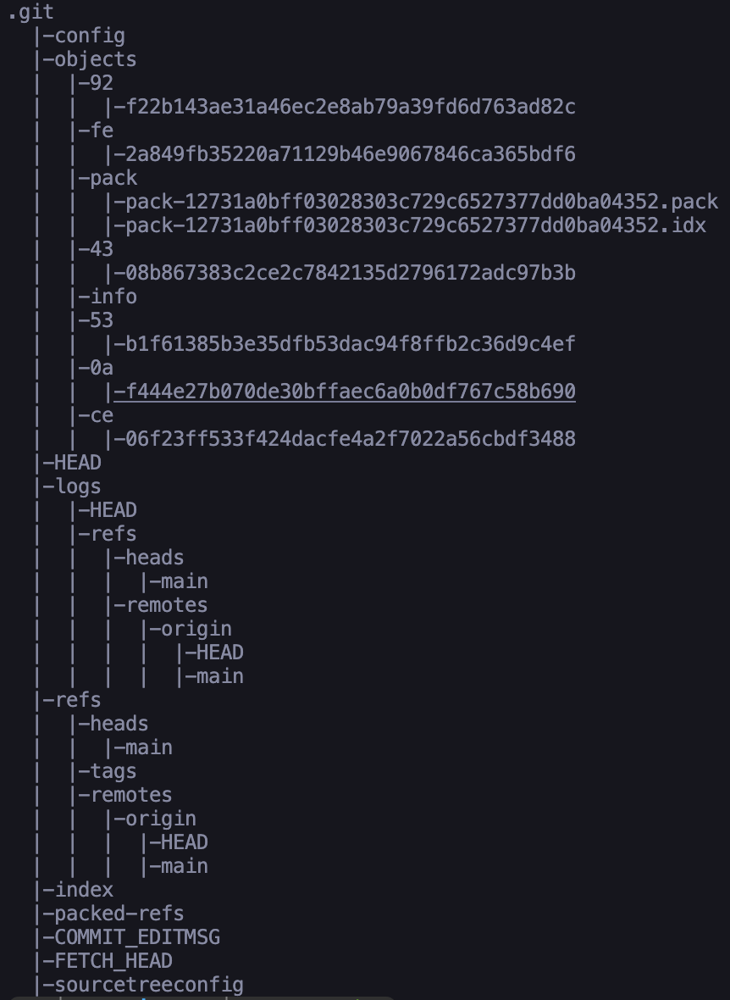
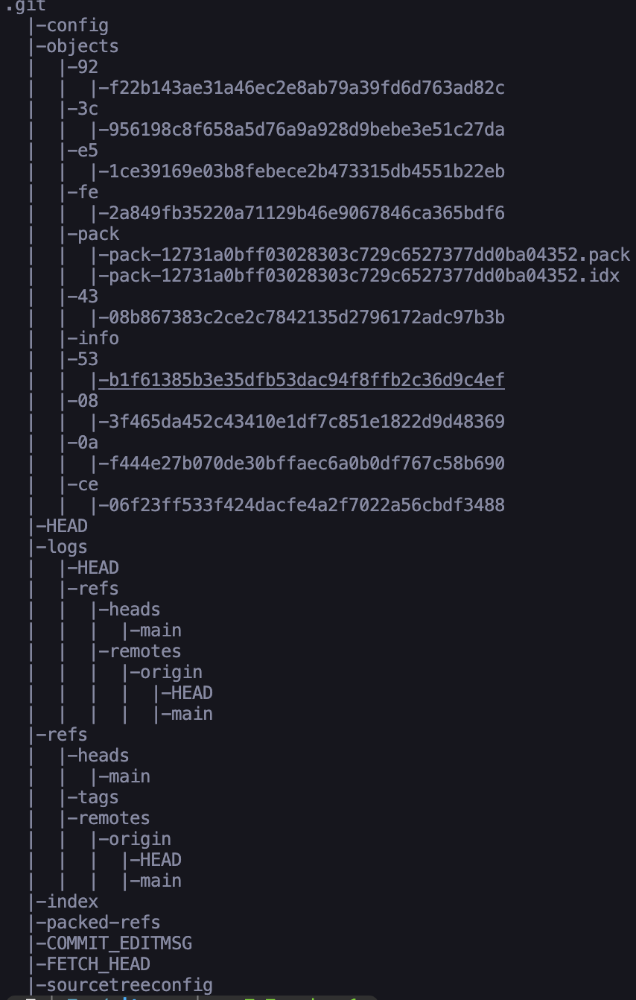

### 說明 blob, tree, commit, branch, head 分別是什麼
- blob
    - Git 用來儲存單一文件內容的物件。當添加一個文件到git中時，文件的內容會存成一個blob，並且該blob有唯一的SHA-1 hash 值
    - 只存文件的內容，不保存文件的文件名稱或其他元數據
    - 當文件的內容產生改變時，git會生成一個新的blob
- tree
    - Git 用來組織文件和目錄結構的物件。是一個層次結構，可以包含多個blob（表示文件）和子tree（表示子目錄）
    - 每個tree物件保存了文件名、文件的blob引用（SHA-1 hash值）以及文件的權限
    - Tree物件的作用是管理文件和目錄之間的關係，形成code倉庫中的文件夾和文件結構
- commit
    - Git 用來記錄倉庫中所有文件的狀態和歷史的物件
    - 每個commit都有一個唯一的SHA-1 hash 值
    - 一個commit 包含以下幾個部分
        - Tree：指向當前的文件和目錄狀態（即包含該commit時的文件系統樹）
        - parent commit（或多個parent commit）：指向上一個commit，紀錄了變更歷史。
        - 作者信息：包括作者的名字、郵箱地址和提交時間。
        - 提交信息：描述這次提交的內容和目的
- branch
    - 分支是一個可變的指針，指向某一個 commit。分支的目的是方便開發者在不同功能或特性之間進行開發和版本管理。
    - 默認的分支名是 `main`（或者在過去的版本中叫 `master`）。當你創建一個新的分支時，Git 會從當前分支的 commit 點出發，並在新分支上繼續發展。
    - 每個分支其實是一個移動的指針，隨著你進行新的 commit，該分支的指針會指向最新的 commit。
- head
    - **HEAD** 是 Git 中的一個特殊的指針，指向當前檢出的 commit 或分支。
    - 如果你在某個分支上工作，`HEAD` 就指向這個分支，並隨著每次提交而移動。
    - 當你進行 `git checkout` 來切換分支時，`HEAD` 就會更新，指向新檢出的分支。
    - **"Detached HEAD"** 狀態指的是 `HEAD` 直接指向一個特定的 commit 而不是分支，這種狀態下的修改如果不創建新的分支將無法保存到版本歷史中。
### 紀錄在 git repo 操作過程中，.git 檔案夾裡的變化，看看你可以觀察到什麼
#### Step1. 從遠端github repo clone 到本地端 (遠端repo 已經含有初始README.md)
> 
#### Step2. 修改 README.md 
> 
### Step3. 新增video.md 
### Step4. 新增git.md 
> 
> 
> 

### commit message 應該怎麼寫比較好？應該有什麼 `style` 嗎？
- commit message和程式註解蠻像的 → commit message 最好能有why & what
    - 這樣做的目的 → 讓日後進行維護人員更快進入狀況
- commit message的組成
    - Header: <type>(<scope>): <subject>
        - type: 代表commit 的類別 [must have]
            - feat: 新增/修改功能 (feature)。
            - fix: 修補 bug (bug fix)。
            - docs: 文件 (documentation)。
            - style: 格式 (不影響程式碼運行的變動 white-space, formatting, missing semi colons, etc)。
            - refactor: 重構 (既不是新增功能，也不是修補 bug 的程式碼變動)。
            - perf: 改善效能 (A code change that improves performance)。
            - test: 增加測試 (when adding missing tests)。
            - chore: 建構程序或輔助工具的變動 (maintain)。
            - revert: 撤銷回覆先前的 commit 例如：revert: type(scope): subject (回覆版本：xxxx)。
        - scope: 代表commit影響的範圍[optional]
        - subject: 代表此commit的簡短描述，不要超過50字元[must have]
    - Body: 對本次commit 的詳細描述 可分成多行，每一行不要超過72字元
        - 說明程式碼變動的項目與原因，與先前行為的對比
    - Footer:
        - 填寫issue編號：[optional]
        - BREAKING CHANGE：[optional]
            - 以BREAKING CHANGE開頭，後面是對變動的描述、以及變動原因和遷移方法
